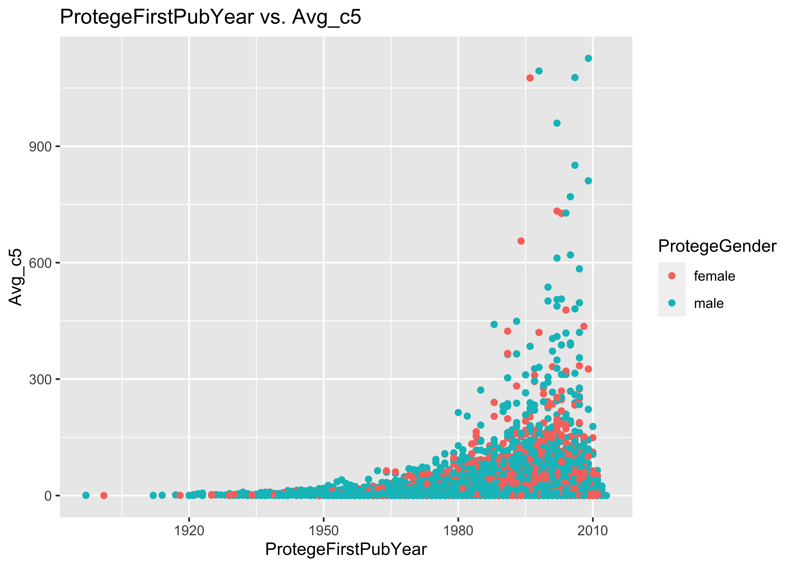

Mentorship
================
Daniel E. Weeks
November 21, 2020, 14:11


-   [1 Load Libraries](#load-libraries)
-   [2 Input directory and files](#input-directory-and-files)
-   [3 The AlShebli et al (2020) mentorship
    paper](#the-alshebli-et-al-2020-mentorship-paper)
-   [4 The data](#the-data)
    -   [4.1 The input data](#the-input-data)
    -   [4.2 Disclaimer: For speed, only read in the first 10^{5}
        lines](#disclaimer-for-speed-only-read-in-the-first-105-lines)
    -   [4.3 Problem: No gender information for
        mentors](#problem-no-gender-information-for-mentors)
-   [5 ProtegeFirstPubYear](#protegefirstpubyear)
-   [6 Distribution of
    ProtegeFirstPubYear](#distribution-of-protegefirstpubyear)
    -   [6.1 Problem: ProtegeFirstPubYear time range is very
        large](#problem-protegefirstpubyear-time-range-is-very-large)
-   [7 NumYearsPostMentorship](#numyearspostmentorship)
    -   [7.1 Problem: Error in the equation for
        NumYearsPostMentorship](#problem-error-in-the-equation-for-numyearspostmentorship)
    -   [7.2 Distribution of
        NumYearsPostMentorship](#distribution-of-numyearspostmentorship)
    -   [7.3 Problem: some values of `NumYearsPostMentorship` are
        unrealistically
        large](#problem-some-values-of-numyearspostmentorship-are-unrealistically-large)
-   [8 AvgMentorsAcAges](#avgmentorsacages)
    -   [8.1 Distribution of
        AvgMentorsAcAges](#distribution-of-avgmentorsacages)
    -   [8.2 Problem: some `AvgMentorsAcAges` are unrealistically
        large](#problem-some-avgmentorsacages-are-unrealistically-large)
-   [9 Avg\_c5](#avg_c5)
    -   [9.1 Distribution of Avg\_c5](#distribution-of-avg_c5)
    -   [9.2 Joint distribution of Avg\_c5 and
        AvgMentorsAcAges](#joint-distribution-of-avg_c5-and-avgmentorsacages)
-   [10 Avg\_c10](#avg_c10)
    -   [10.1 Distribution of Avg\_c10](#distribution-of-avg_c10)
    -   [10.2 Problem with Avg\_c10: Cannot compute a value Avg\_c10 for
        recent
        publications](#problem-with-avg_c10-cannot-compute-a-value-avg_c10-for-recent-publications)
-   [11 Avg\_c5 vs Avg\_c10](#avg_c5-vs-avg_c10)
    -   [11.1 Tables of Avg\_c5 and
        Avg\_c10](#tables-of-avg_c5-and-avg_c10)
    -   [11.2 Joint distribution of Avg\_c5 and
        Avg\_c10](#joint-distribution-of-avg_c5-and-avg_c10)
-   [12 numMentors](#nummentors)
    -   [12.1 Distribution of numMentors](#distribution-of-nummentors)
    -   [12.2 Problem: some `numMentors` values are too
        large](#problem-some-nummentors-values-are-too-large)
-   [13 Summary](#summary)
    -   [13.1 Problem: No gender information for
        mentors](#problem-no-gender-information-for-mentors-1)
    -   [13.2 Problem: ProtegeFirstPubYear time range is very
        large](#problem-protegefirstpubyear-time-range-is-very-large-1)
    -   [13.3 Problem: Error in the equation for
        NumYearsPostMentorship](#problem-error-in-the-equation-for-numyearspostmentorship-1)
    -   [13.4 Problem: some values of `NumYearsPostMentorship` are
        unrealistically
        large](#problem-some-values-of-numyearspostmentorship-are-unrealistically-large-1)
    -   [13.5 Problem: some `AvgMentorsAcAges` are unrealistically
        large](#problem-some-avgmentorsacages-are-unrealistically-large-1)
    -   [13.6 Problem with Avg\_c10: Cannot compute a value `Avg_c10`
        for recent
        publications](#problem-with-avg_c10-cannot-compute-a-value-avg_c10-for-recent-publications-1)
    -   [13.7 Problem: some `numMentors` values are too
        large](#problem-some-nummentors-values-are-too-large-1)
-   [14 Generating GitHub Markdown](#generating-github-markdown)
-   [15 Session Information](#session-information)

# 1 Load Libraries

``` r
library(tidyverse)
# library(tidylog)
library(ggExtra)
library(arsenal)
```

# 2 Input directory and files

``` r
# Print the working directory
getwd()
```

    ## [1] "/Users/dweeks/data/Mentorship"

# 3 The AlShebli et al (2020) mentorship paper

Here I examine the data provided by the authors of this paper:

AlShebli B, Makovi K, Rahwan T. The association between early career
informal mentorship in academic collaborations and junior author
performance. Nat Commun. 2020 Nov 17;11(1):5855. doi:
10.1038/s41467-020-19723-8. PMID: 33203848.
<https://pubmed.ncbi.nlm.nih.gov/33203848/>

# 4 The data

## 4.1 The input data

The input data are from the ‘bedoor/Mentorship’ GitHub repository at

<https://github.com/bedoor/Mentorship>

Their repository is described as:

‘This repository includes all data used in “The Association between
Early Career Informal Mentorship in Academic Collaborations and Junior
Author Performance”.’

``` r
LinesRead <- 1e+05
inFile <- "Mentorship/Repository_Data/Data_7yearcutoff.csv"
a <- read_csv(file = inFile, n_max = LinesRead)
```

    ## Parsed with column specification:
    ## cols(
    ##   .default = col_double(),
    ##   Pr0tegeGender = col_character(),
    ##   AffiliationRank = col_character()
    ## )

    ## See spec(...) for full column specifications.

``` r
names(a)
```

    ##  [1] "Disambiguated_ProtegeID"   "AvgBigShot"               
    ##  [3] "AvgBigShotBin"             "AvgHub"                   
    ##  [5] "AvgHubBin"                 "Avg_c5"                   
    ##  [7] "numMentors"                "numMentorsBin"            
    ##  [9] "ProtegeFirstPubYear"       "ProtegeFirstPubYearBin"   
    ## [11] "Pr0tegeGender"             "ProtegeGenderBin"         
    ## [13] "AffiliationRank"           "AffiliationRankBin"       
    ## [15] "AvgMentorsAcAges"          "AvgMentorsAcAgesBin"      
    ## [17] "NumYearsPostMentorship"    "NumYearsPostMentorshipBin"
    ## [19] "ProtegeDisciplineID"       "Avg_c10"                  
    ## [21] "MaxBigShot"                "MaxBigShotBin"            
    ## [23] "MedianBigShot"             "MedianBigShotBin"         
    ## [25] "MaxHub"                    "MaxHubBin"                
    ## [27] "MedianHub"                 "MedianHubBin"

``` r
total_records <- as.integer(system2("wc", args = c("-l", inFile, " | awk '{print $1}'"), 
    stdout = TRUE))
total_records
```

    ## [1] 1055213

## 4.2 Disclaimer: For speed, only read in the first 10^{5} lines

To speed up the analyses, we read only the first 10^{5} lines of the
input file, instead of reading all 1055213 lines.

## 4.3 Problem: No gender information for mentors

There does not appear to be any information in the provided file about
the mentor’s gender, so the provided data do not appear to be ‘all the
data’.

There is no data dictionary, so we are left to infer what is in each
column of the data file from the column names and content.

# 5 ProtegeFirstPubYear

# 6 Distribution of ProtegeFirstPubYear

“Year of the protege’s first publication: The year in which the protege
published their first mentored paper.”

``` r
summary(a$ProtegeFirstPubYear)
```

    ##    Min. 1st Qu.  Median    Mean 3rd Qu.    Max. 
    ##    1897    1992    2000    1997    2006    2013

``` r
ggplot(data = a, mapping = aes(x = ProtegeFirstPubYear)) + geom_histogram() + ggtitle("Distribution of ProtegeFirstPubYear")
```

    ## `stat_bin()` using `bins = 30`. Pick better value with `binwidth`.

<!-- -->

``` r
table(a$Pr0tegeGender)
```

    ## 
    ## female   male 
    ##  34257  65743

``` r
ggplot(data = a, mapping = aes(x = ProtegeFirstPubYear)) + geom_histogram() + ggtitle("Distribution of ProtegeFirstPubYear") + 
    facet_grid(~Pr0tegeGender)
```

    ## `stat_bin()` using `bins = 30`. Pick better value with `binwidth`.

<!-- -->

``` r
a$MaleProtegeFirstPubYear <- a$ProtegeFirstPubYear
a$MaleProtegeFirstPubYear[a$Pr0tegeGender == "female"] <- NA

a$FemaleProtegeFirstPubYear <- a$ProtegeFirstPubYear
a$FemaleProtegeFirstPubYear[a$Pr0tegeGender == "male"] <- NA

summary(a$MaleProtegeFirstPubYear)
```

    ##    Min. 1st Qu.  Median    Mean 3rd Qu.    Max.    NA's 
    ##    1897    1990    1999    1996    2005    2013   34257

``` r
summary(a$FemaleProtegeFirstPubYear)
```

    ##    Min. 1st Qu.  Median    Mean 3rd Qu.    Max.    NA's 
    ##    1901    1995    2002    2000    2007    2013   65743

``` r
p <- ggplot(data = a, aes(x = x)) + geom_histogram(aes(x = MaleProtegeFirstPubYear, 
    y = ..density..), fill = "#69b3a2") + annotate("text", x = 1950, y = 0.03, label = "MaleProtegeFirstPubYear", 
    color = "#69b3a2") + geom_histogram(aes(x = FemaleProtegeFirstPubYear, y = -..density..), 
    fill = "#404080") + annotate("text", x = 1950, y = -0.03, label = "FemaleProtegeFirstPubYear", 
    color = "#404080") + xlab("ProtegeFirstPubYear") + ggtitle("Distributions of ProtegeFirstPubYear by gender")
p
```

    ## `stat_bin()` using `bins = 30`. Pick better value with `binwidth`.

    ## Warning: Removed 34257 rows containing non-finite values (stat_bin).

    ## `stat_bin()` using `bins = 30`. Pick better value with `binwidth`.

    ## Warning: Removed 65743 rows containing non-finite values (stat_bin).

<!-- -->

``` r
p <- ggplot(data = a, aes(x = x)) + geom_density(aes(x = MaleProtegeFirstPubYear, 
    y = ..density..), fill = "#69b3a2") + annotate("text", x = 1950, y = 0.03, label = "MaleProtegeFirstPubYear", 
    color = "#69b3a2") + geom_density(aes(x = FemaleProtegeFirstPubYear, y = -..density..), 
    fill = "#404080") + annotate("text", x = 1950, y = -0.03, label = "FemaleProtegeFirstPubYear", 
    color = "#404080") + xlab("ProtegeFirstPubYear") + ggtitle("Distributions of ProtegeFirstPubYear by gender")
p
```

    ## Warning: Removed 34257 rows containing non-finite values
    ## (stat_density).

    ## Warning: Removed 65743 rows containing non-finite values
    ## (stat_density).

<!-- -->

## 6.1 Problem: ProtegeFirstPubYear time range is very large

in the first 10^{5} lines of this data set, the `ProtegeFirstPubYear`
ranges from 1897 to 2013. It seems that it would be very difficult to
properly compare the impact factors of papers published in
`r`min(a$ProtegeFirstPubYear)\`, well before the advent of team science
and the current deluge of scientific publications, to those published as
recently 2013.

# 7 NumYearsPostMentorship

“The number of years post mentorship: Since our dataset is up to Dec
31st 2019, we are only able to calculate c5—the number of citations
accumulated five years post publication—for papers published before
2015. Thus, given a protege whose first paper was published in year x,
the number of years post mentorship is `2015 - (x + 6)`, bearing in mind
that the mentorship period is 7 years and we do not include proteges
with a gap of 5 years of more in their career history.”

## 7.1 Problem: Error in the equation for NumYearsPostMentorship

Note that the stated equation of `2015 - (x + 6)` for computing the
number of years post mentorship is not what was used, as instead
`2015 - (x + 2)`, where `x` is the year the protege’s paper was first
published, as we see here in the first 10^{5} lines of the input file:

``` r
all.equal(a$NumYearsPostMentorship, 2015 - (a$ProtegeFirstPubYear + 2))
```

    ## [1] TRUE

## 7.2 Distribution of NumYearsPostMentorship

``` r
summary(a$NumYearsPostMentorship)
```

    ##    Min. 1st Qu.  Median    Mean 3rd Qu.    Max. 
    ##    0.00    7.00   13.00   15.68   21.00  116.00

``` r
ggplot(data = a, mapping = aes(x = NumYearsPostMentorship)) + geom_histogram() + 
    ggtitle("Distribution of NumYearsPostMentorship")
```

    ## `stat_bin()` using `bins = 30`. Pick better value with `binwidth`.

<!-- -->

``` r
a$ProtegeGender <- as.factor(a$Pr0tegeGender)
p <- ggplot(data = a, mapping = aes(x = ProtegeFirstPubYear, y = NumYearsPostMentorship)) + 
    geom_point() + ggtitle("NumYearsPostMentorship vs. ProtegeFirstPubYear")
ggMarginal(p, type = "histogram")
```

<!-- -->

## 7.3 Problem: some values of `NumYearsPostMentorship` are unrealistically large

In the first 10^{5} lines of the input file of this data set, there are
values of `NumYearsPostMentorship` as large as 116. These values are
unrealistically large.

# 8 AvgMentorsAcAges

## 8.1 Distribution of AvgMentorsAcAges

“Average academic age of mentors: This is computed for any given protege
by first computing the academic age of each mentor in the year of their
first publication with the protege, and then averaging these numbers
over all the mentors.”

“Given a scientist whose first paper was published in year x, the
academic age of this scientist in year y is y-x.”

``` r
summary(a$AvgMentorsAcAges)
```

    ##    Min. 1st Qu.  Median    Mean 3rd Qu.    Max. 
    ##    7.00   13.00   16.67   18.18   21.00  213.00

``` r
ggplot(data = a, mapping = aes(x = AvgMentorsAcAges)) + geom_histogram() + ggtitle("Distribution of AvgMentorsAcAges")
```

    ## `stat_bin()` using `bins = 30`. Pick better value with `binwidth`.

<!-- -->

``` r
ggplot(data = a, mapping = aes(x = ProtegeFirstPubYear, y = AvgMentorsAcAges, col = ProtegeGender)) + 
    geom_point() + ggtitle("ProtegeFirstPubYear vs. AvgMentorsAcAges")
```

<!-- -->

``` r
ggplot(data = a, mapping = aes(x = ProtegeFirstPubYear, y = AvgMentorsAcAges)) + 
    geom_point() + facet_grid(~ProtegeGender) + ggtitle("ProtegeFirstPubYear vs. AvgMentorsAcAges by ProtegeGender")
```

<!-- -->

## 8.2 Problem: some `AvgMentorsAcAges` are unrealistically large

There are `AvgMentorsAcAges` as large as 213 in the first 10^{5} lines
of this data set. This is unrealistically large.

Among proteges who published their first paper after 2000, there are
`AvgMentorsAcAges` as large as 213 in this data set. Should we be
evaluating the mentorship effects of mentors who were born than 200
years ago?

# 9 Avg\_c5

## 9.1 Distribution of Avg\_c5

``` r
summary(a$Avg_c5)
```

    ##     Min.  1st Qu.   Median     Mean  3rd Qu.     Max. 
    ##    0.000    2.068    6.692   11.557   14.254 1126.429

``` r
ggplot(data = a, mapping = aes(x = Avg_c5)) + geom_histogram() + ggtitle("Distribution of Avg_c5")
```

    ## `stat_bin()` using `bins = 30`. Pick better value with `binwidth`.

<!-- -->

``` r
ggplot(data = a, mapping = aes(x = ProtegeFirstPubYear, y = Avg_c5, col = ProtegeGender)) + 
    geom_point() + ggtitle("ProtegeFirstPubYear vs. Avg_c5")
```

<!-- -->

``` r
ggplot(data = a, mapping = aes(x = ProtegeFirstPubYear, y = Avg_c5)) + geom_point() + 
    facet_grid(~ProtegeGender) + ggtitle("ProtegeFirstPubYear vs. Avg_c5")
```

<!-- -->

## 9.2 Joint distribution of Avg\_c5 and AvgMentorsAcAges

``` r
ggplot(data = a, mapping = aes(y = Avg_c5, x = AvgMentorsAcAges, col = ProtegeGender)) + 
    geom_point() + ggtitle("Avg_c5 vs. AvgMentorsAcAges")
```

<!-- -->

``` r
ggplot(data = a, mapping = aes(y = Avg_c5, x = AvgMentorsAcAges, col = ProtegeFirstPubYear)) + 
    geom_point() + scale_color_gradient(low = "red", high = "blue") + facet_grid(~ProtegeGender) + 
    ggtitle("Avg_c5 vs. AvgMentorsAcAges")
```

<!-- -->

# 10 Avg\_c10

## 10.1 Distribution of Avg\_c10

``` r
summary(a$Avg_c10)
```

    ##     Min.  1st Qu.   Median     Mean  3rd Qu.     Max. 
    ##    0.000    2.694    9.093   16.945   20.857 3057.000

``` r
ggplot(data = a, mapping = aes(x = Avg_c10)) + geom_histogram() + ggtitle("Distribution of Avg_c10")
```

    ## `stat_bin()` using `bins = 30`. Pick better value with `binwidth`.

<!-- -->

``` r
ggplot(data = a, mapping = aes(x = ProtegeFirstPubYear, y = Avg_c10, col = ProtegeGender)) + 
    geom_point() + ggtitle("ProtegeFirstPubYear vs. Avg_c10")
```

<!-- -->

``` r
ggplot(data = a, mapping = aes(x = ProtegeFirstPubYear, y = Avg_c10)) + geom_point() + 
    facet_grid(~ProtegeGender) + ggtitle("ProtegeFirstPubYear vs. Avg_c10")
```

<!-- -->

## 10.2 Problem with Avg\_c10: Cannot compute a value Avg\_c10 for recent publications

As the dataset is up to Dec 31st 2019, how can one compute a valid
Avg\_c10 for someone whose first publication year was 2012 or 2013?

``` r
a %>% filter(ProtegeFirstPubYear == max(ProtegeFirstPubYear) - 1) %>% select(ProtegeFirstPubYear, 
    Avg_c5, Avg_c10) %>% head(20)
```

    ## # A tibble: 20 x 3
    ##    ProtegeFirstPubYear Avg_c5 Avg_c10
    ##                  <dbl>  <dbl>   <dbl>
    ##  1                2012  0       0    
    ##  2                2012  0       0    
    ##  3                2012  0       0    
    ##  4                2012  0.5     0.5  
    ##  5                2012  0.5     0.5  
    ##  6                2012  0       0    
    ##  7                2012  0.5     0.5  
    ##  8                2012  0.5     0.5  
    ##  9                2012  0       0    
    ## 10                2012  0.182   0.182
    ## 11                2012  0.182   0.182
    ## 12                2012  0.182   0.182
    ## 13                2012  0.2     0.2  
    ## 14                2012  0       0    
    ## 15                2012  0       0    
    ## 16                2012  0       0    
    ## 17                2012  0       0    
    ## 18                2012  0       0    
    ## 19                2012  0       0    
    ## 20                2012  0       0

# 11 Avg\_c5 vs Avg\_c10

## 11.1 Tables of Avg\_c5 and Avg\_c10

``` r
my_controls <- tableby.control(test = T, total = T, numeric.stats = c("meansd", "medianq1q3", 
    "range", "Nmiss2"), cat.stats = c("countpct", "Nmiss2"), stats.labels = list(meansd = "Mean (SD)", 
    medianq1q3 = "Median (Q1, Q3)", range = "Min - Max", Nmiss2 = "Missing"))

my_controls2 <- tableby.control(numeric.stats = c("medianq1q3"), stats.labels = list(medianq1q3 = "Median (Q1, Q3)"))

t.test(Avg_c5 ~ ProtegeGender, data = a)
```

    ## 
    ##  Welch Two Sample t-test
    ## 
    ## data:  Avg_c5 by ProtegeGender
    ## t = 4.0045, df = 69256, p-value = 6.22e-05
    ## alternative hypothesis: true difference in means is not equal to 0
    ## 95 percent confidence interval:
    ##  0.3010699 0.8783127
    ## sample estimates:
    ## mean in group female   mean in group male 
    ##             11.94469             11.35500

``` r
t.test(Avg_c10 ~ ProtegeGender, data = a)
```

    ## 
    ##  Welch Two Sample t-test
    ## 
    ## data:  Avg_c10 by ProtegeGender
    ## t = 2.6735, df = 69586, p-value = 0.007508
    ## alternative hypothesis: true difference in means is not equal to 0
    ## 95 percent confidence interval:
    ##  0.1643062 1.0669714
    ## sample estimates:
    ## mean in group female   mean in group male 
    ##             17.34958             16.73394

``` r
t1 <- tableby(ProtegeGender ~ ., data = a %>% select(ProtegeGender, Avg_c5, Avg_c10))
```

``` r
summary(t1, title = "Table of Avg_c5 and Avg_c10 by ProtegeGender")
```

|              | female (N=34257) |  male (N=65743)  | Total (N=100000) |    p value |
|:-------------|:----------------:|:----------------:|:----------------:|-----------:|
| **Avg\_c5**  |                  |                  |                  | &lt; 0.001 |
|    Mean (SD) | 11.945 (22.121)  | 11.355 (22.056)  | 11.557 (22.080)  |            |
|    Range     | 0.000 - 1076.000 | 0.000 - 1126.429 | 0.000 - 1126.429 |            |
| **Avg\_c10** |                  |                  |                  |      0.008 |
|    Mean (SD) | 17.350 (34.528)  | 16.734 (34.614)  | 16.945 (34.586)  |            |
|    Range     | 0.000 - 2128.000 | 0.000 - 3057.000 | 0.000 - 3057.000 |            |

Table of Avg\_c5 and Avg\_c10 by ProtegeGender

``` r
t1 <- tableby(ProtegeGender ~ ., data = a %>% select(ProtegeGender, Avg_c5, Avg_c10), 
    control = my_controls2)
```

``` r
summary(t1, title = "Table of Avg_c5 and Avg_c10 by ProtegeGender")
```

|                    |   female (N=34257)    |    male (N=65743)     |   Total (N=100000)    |    p value |
|:-------------------|:---------------------:|:---------------------:|:---------------------:|-----------:|
| **Avg\_c5**        |                       |                       |                       | &lt; 0.001 |
|    Median (Q1, Q3) | 7.000 (2.000, 15.000) | 6.565 (2.182, 13.969) | 6.692 (2.068, 14.254) |            |
| **Avg\_c10**       |                       |                       |                       |      0.008 |
|    Median (Q1, Q3) | 9.000 (2.286, 21.510) | 9.111 (2.935, 20.425) | 9.093 (2.694, 20.857) |            |

Table of Avg\_c5 and Avg\_c10 by ProtegeGender

``` r
t1 <- tableby(ProtegeGender ~ ., data = a %>% select(ProtegeGender, Avg_c5, Avg_c10), 
    control = my_controls)
```

``` r
summary(t1, title = "Table of Avg_c5 and Avg_c10 by ProtegeGender")
```

|                    |   female (N=34257)    |    male (N=65743)     |   Total (N=100000)    |    p value |
|:-------------------|:---------------------:|:---------------------:|:---------------------:|-----------:|
| **Avg\_c5**        |                       |                       |                       | &lt; 0.001 |
|    Mean (SD)       |    11.945 (22.121)    |    11.355 (22.056)    |    11.557 (22.080)    |            |
|    Median (Q1, Q3) | 7.000 (2.000, 15.000) | 6.565 (2.182, 13.969) | 6.692 (2.068, 14.254) |            |
|    Min - Max       |   0.000 - 1076.000    |   0.000 - 1126.429    |   0.000 - 1126.429    |            |
|    Missing         |           0           |           0           |           0           |            |
| **Avg\_c10**       |                       |                       |                       |      0.008 |
|    Mean (SD)       |    17.350 (34.528)    |    16.734 (34.614)    |    16.945 (34.586)    |            |
|    Median (Q1, Q3) | 9.000 (2.286, 21.510) | 9.111 (2.935, 20.425) | 9.093 (2.694, 20.857) |            |
|    Min - Max       |   0.000 - 2128.000    |   0.000 - 3057.000    |   0.000 - 3057.000    |            |
|    Missing         |           0           |           0           |           0           |            |

Table of Avg\_c5 and Avg\_c10 by ProtegeGender

## 11.2 Joint distribution of Avg\_c5 and Avg\_c10

``` r
ggplot(data = a, mapping = aes(x = Avg_c5, y = Avg_c10, col = ProtegeGender)) + geom_point() + 
    geom_abline(intercept = 0, slope = 1, col = "red") + ggtitle("Avg_c5 vs. Avg_c10")
```

<!-- -->

``` r
ggplot(data = a, mapping = aes(x = Avg_c5, y = Avg_c10, col = ProtegeFirstPubYear)) + 
    geom_point() + scale_color_gradient(low = "red", high = "blue") + geom_abline(intercept = 0, 
    slope = 1, col = "red") + facet_grid(~ProtegeGender) + ggtitle("Avg_c5 vs. Avg_c10")
```

<!-- -->

# 12 numMentors

## 12.1 Distribution of numMentors

``` r
summary(a$numMentors)
```

    ##    Min. 1st Qu.  Median    Mean 3rd Qu.    Max. 
    ##   1.000   1.000   3.000   4.514   6.000  91.000

``` r
ggplot(data = a, mapping = aes(x = numMentors)) + geom_histogram() + ggtitle("Distribution of numMentors")
```

    ## `stat_bin()` using `bins = 30`. Pick better value with `binwidth`.

<!-- -->

``` r
ggplot(data = a, mapping = aes(x = ProtegeFirstPubYear, y = numMentors, col = ProtegeGender)) + 
    geom_point() + ggtitle("ProtegeFirstPubYear vs. numMentors")
```

<!-- -->

``` r
ggplot(data = a, mapping = aes(x = ProtegeFirstPubYear, y = numMentors)) + geom_point() + 
    facet_grid(~ProtegeGender) + ggtitle("ProtegeFirstPubYear vs. numMentors")
```

<!-- -->

## 12.2 Problem: some `numMentors` values are too large

How could someone possibly really have more than a handful of mentors?

In the first 10^{5} lines of this data set, there are individuals with
91 mentors!

The Supplement states that:

“Whenever a junior scientist publishes a paper with a senior scientist,
we consider the former to be a protege, and the latter to be a mentor,
as long as they authored at least one paper with 20 or less co-authors
and share the same discipline and US-based affiliation.”

Oh, but we are really measuring co-authorship at the same US-based
affiliation on joint papers with 20 or less co-authors.

# 13 Summary

Here I examine the data provided by the authors of this paper:

AlShebli B, Makovi K, Rahwan T. The association between early career
informal mentorship in academic collaborations and junior author
performance. Nat Commun. 2020 Nov 17;11(1):5855. doi:
10.1038/s41467-020-19723-8. PMID: 33203848.
<https://pubmed.ncbi.nlm.nih.gov/33203848/>

For speed, I examined only the first 10^{5} lines of the data file
Mentorship/Repository\_Data/Data\_7yearcutoff.csv from the
‘bedoor/Mentorship’ GitHub repository at

<https://github.com/bedoor/Mentorship>

Their repository is described by the authors as:

‘This repository includes all data used in “The Association between
Early Career Informal Mentorship in Academic Collaborations and Junior
Author Performance”.’

## 13.1 Problem: No gender information for mentors

There does not appear to be any information in the provided file about
the mentor’s gender, so the provided data do not appear to be ‘all the
data’.

## 13.2 Problem: ProtegeFirstPubYear time range is very large

In the first 10^{5} lines of this data set, the `ProtegeFirstPubYear`
ranges from 1897 to 2013. It seems that it would be very difficult to
properly compare the impact factors of papers published in 1897, well
before the advent of team science and the current deluge of scientific
publications, to those published as recently 2013.

<!-- -->

## 13.3 Problem: Error in the equation for NumYearsPostMentorship

Note that the stated equation of `2015 - (x + 6)` for computing the
number of years post mentorship is not what was used, as instead
`2015 - (x + 2)`, where `x` is the year the protege’s paper was first
published.

## 13.4 Problem: some values of `NumYearsPostMentorship` are unrealistically large

In the first 10^{5} lines of the input file of this data set, there are
values of `NumYearsPostMentorship` as large as 116. These values are
unrealistically large.

<!-- -->

## 13.5 Problem: some `AvgMentorsAcAges` are unrealistically large

There are `AvgMentorsAcAges` as large as 213 in the first 10^{5} lines
of this data set. This is unrealistically large.

Among proteges who published their first paper after 2000, there are
`AvgMentorsAcAges` as large as 213 in this data set. Should we be
evaluating the mentorship effects of mentors who were born than 200
years ago?

<!-- -->

## 13.6 Problem with Avg\_c10: Cannot compute a value `Avg_c10` for recent publications

As the dataset is up to Dec 31st 2019, how can one compute a valid
`Avg_c10` for someone whose first publication year was 2012 or 2013?

<!-- -->

## 13.7 Problem: some `numMentors` values are too large

How could someone possibly really have more than a handful of mentors?

In the first 10^{5} lines of this data set, there are individuals with
91 mentors!

The Supplement states that:

“Whenever a junior scientist publishes a paper with a senior scientist,
we consider the former to be a protege, and the latter to be a mentor,
as long as they authored at least one paper with 20 or less co-authors
and share the same discipline and US-based affiliation.”

Oh, but we are really measuring **co-authorship** at the same US-based
affiliation on joint papers with 20 or less co-authors.

<!-- -->

# 14 Generating GitHub Markdown

``` r
library(rmarkdown)
library(here)
finalize <- function() {
    rmd <- here("mentorship.Rmd")
    rmarkdown::render(rmd, "github_document")
}
```

# 15 Session Information

``` r
sessionInfo()
```

    ## R version 4.0.2 (2020-06-22)
    ## Platform: x86_64-apple-darwin17.0 (64-bit)
    ## Running under: macOS High Sierra 10.13.6
    ## 
    ## Matrix products: default
    ## BLAS:   /System/Library/Frameworks/Accelerate.framework/Versions/A/Frameworks/vecLib.framework/Versions/A/libBLAS.dylib
    ## LAPACK: /Library/Frameworks/R.framework/Versions/4.0/Resources/lib/libRlapack.dylib
    ## 
    ## locale:
    ## [1] en_US.UTF-8/en_US.UTF-8/en_US.UTF-8/C/en_US.UTF-8/en_US.UTF-8
    ## 
    ## attached base packages:
    ## [1] stats     graphics  grDevices utils     datasets  methods  
    ## [7] base     
    ## 
    ## other attached packages:
    ##  [1] here_0.1        rmarkdown_2.5   arsenal_3.4.0   ggExtra_0.9    
    ##  [5] forcats_0.5.0   stringr_1.4.0   dplyr_1.0.0     purrr_0.3.4    
    ##  [9] readr_1.3.1     tidyr_1.1.2     tibble_3.0.1    ggplot2_3.3.0  
    ## [13] tidyverse_1.3.0 knitr_1.30     
    ## 
    ## loaded via a namespace (and not attached):
    ##  [1] Rcpp_1.0.4.6     lubridate_1.7.8  lattice_0.20-41 
    ##  [4] utf8_1.1.4       rprojroot_1.3-2  assertthat_0.2.1
    ##  [7] digest_0.6.25    mime_0.9         R6_2.4.1        
    ## [10] cellranger_1.1.0 backports_1.1.7  reprex_0.3.0    
    ## [13] evaluate_0.14    highr_0.8        httr_1.4.2      
    ## [16] pillar_1.4.4     rlang_0.4.6      readxl_1.3.1    
    ## [19] rstudioapi_0.11  miniUI_0.1.1.1   Matrix_1.2-18   
    ## [22] splines_4.0.2    labeling_0.3     munsell_0.5.0   
    ## [25] shiny_1.5.0      broom_0.5.6      compiler_4.0.2  
    ## [28] httpuv_1.5.4     modelr_0.1.7     xfun_0.17       
    ## [31] pkgconfig_2.0.3  htmltools_0.5.0  tidyselect_1.1.0
    ## [34] fansi_0.4.1      crayon_1.3.4     dbplyr_1.4.3    
    ## [37] withr_2.2.0      later_1.0.0      grid_4.0.2      
    ## [40] nlme_3.1-148     jsonlite_1.6.1   xtable_1.8-4    
    ## [43] gtable_0.3.0     lifecycle_0.2.0  DBI_1.1.0       
    ## [46] formatR_1.7      magrittr_1.5     scales_1.1.1    
    ## [49] cli_2.0.2        stringi_1.4.6    farver_2.0.3    
    ## [52] fs_1.4.1         promises_1.1.0   xml2_1.3.2      
    ## [55] ellipsis_0.3.1   generics_0.0.2   vctrs_0.3.1     
    ## [58] tools_4.0.2      glue_1.4.1       hms_0.5.3       
    ## [61] survival_3.1-12  fastmap_1.0.1    yaml_2.2.1      
    ## [64] colorspace_1.4-1 rvest_0.3.5      haven_2.2.0
